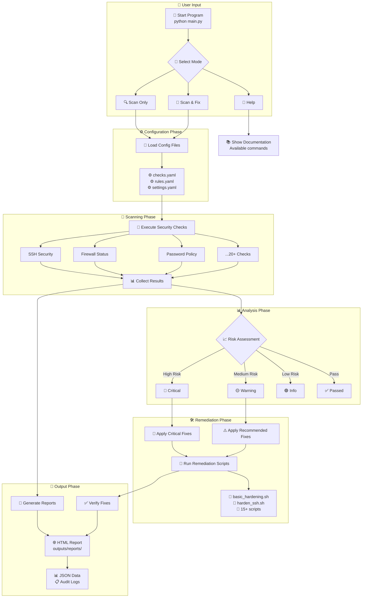

# Linux Security Audit 🔒


**Linux Security Audit** is an automated, production‑ready security scanner for Linux systems that identifies **common misconfigurations**, optionally **remediates issues**, and generates **professional reports** suitable for audits and compliance reviews.

---
## 📘 Documentation
[Download Full Project Documentation (PDF)](docs/1_Linux_Hardening_Security_Audit_docs.pdf)

---
## ✨ Highlights

* **Comprehensive Audits** — SSH, password policies, file permissions, kernel parameters, logging, and more
* **Auto‑Remediation** — Safely fix common misconfigurations (opt‑in)
* **Professional Reports** — HTML, PDF, and JSON outputs
* **Profiles & Custom Rules** — Tailor scans for servers, workstations, or compliance needs
* **Compliance‑Aware** — CIS‑style checks and industry best practices
* **Safe by Design** — Read‑only mode for sensitive environments

---

## 🚀 Quick Start

### Prerequisites

* Python **3.8+**
* Linux (tested on **Ubuntu**, **CentOS**, **RHEL**)
* `sudo`/root access *(only required for auto‑fixes)*

### Installation

```bash
# Clone
 git clone https://github.com/thevipul1/Linux_Security_Audit.git
 cd Linux_Security_Audit

# Install dependencies
 pip install -r requirements.txt

# Run a basic audit
 python src/main.py --scan basic
```

---

## 🧪 Usage

```bash
# Comprehensive scan
python src/main.py --scan comprehensive

# Enable auto-fix
python src/main.py --scan comprehensive --auto-fix

# Generate HTML report only
python src/main.py --scan basic --report html

# Test the scanner works
sudo python3 main.py --scan --format text

# Generate comprehensive cybersecurity report
sudo python3 main.py --scan --format html --output outputs/reports/cybersecurity_audit.html

# Custom profile with PDF output
python src/main.py --profile webserver --report pdf
```

### Advanced Examples

```bash
# Production-safe scan (no changes)
python src/main.py --scan production --read-only --report html,json

# Use a custom configuration
python src/main.py --config custom_profile.yaml --verbose

# Schedule daily scan (cron)
0 2 * * * /opt/Linux_Security_Audit/src/main.py --scan basic --report html --email admin@company.com
```

---

## 🧩 Installation Options

### 1) Direct Clone (Recommended)

```bash
git clone https://github.com/thevipul1/Linux_Security_Audit.git
cd Linux_Security_Audit
pip install -r requirements.txt
```

### 2) Docker

```bash
docker build -t linux-security-audit .
docker run -v /etc:/host/etc linux-security-audit --scan basic
```

### 3) System Package *(Planned)*

```bash
# Coming soon
wget https://github.com/thevipul1/Linux_Security_Audit/releases/latest/linux-security-audit.deb
sudo dpkg -i linux-security-audit.deb
```

---

## 📊 Scan Coverage

| Category              | Examples                       | Auto‑Fix   |
| --------------------- | ------------------------------ | ---------- |
| **SSH Security**      | Root login, protocol, key auth | ✅          |
| **Password Policies** | Aging, complexity              | ✅          |
| **File Permissions**  | World‑writable, SUID           | ✅          |
| **Network Security**  | Open ports, firewall           | ⚠️ Partial |
| **System Updates**    | Security patches               | ❌          |
| **Audit & Logging**   | auditd, log rotation           | ✅          |
| **Kernel Hardening**  | `sysctl` parameters            | ✅          |

---

## 📁 Project Structure

```text

1_Linux_hardening_and_security_audit
├── config
│   ├── checks.yaml
│   ├── rules.yaml
│   └── settings.yaml
├── debug_scan.py
├── main.py
├── modules
│   ├── __init__.py
│   ├── __pycache__
│   │   ├── __init__.cpython-312.pyc
│   │   ├── __init__.cpython-313.pyc
│   │   ├── remediator.cpython-312.pyc
│   │   ├── remediator.cpython-313.pyc
│   │   ├── reporter.cpython-312.pyc
│   │   ├── reporter.cpython-313.pyc
│   │   ├── scanner.cpython-312.pyc
│   │   ├── scanner.cpython-313.pyc
│   │   ├── utils.cpython-312.pyc
│   │   └── utils.cpython-313.pyc
│   ├── remediator.py
│   ├── reporter.py
│   ├── scanner.py
│   └── utils.py
├── outputs
│   ├── logs
│   │   └── audit.log
│   └── reports
│       ├── cybersecurity_audit.html
│       ├── debug_scan.json
│       └── secure_scan.json
├── readme.txt
├── remediations
│   ├── audit_suid_files.sh
│   ├── basic_hardening.sh
│   ├── close_unused_ports.sh
│   ├── configure_fail2ban.sh
│   ├── disable_ip_forwarding.sh
│   ├── enforce_password_policy.sh
│   ├── harden_kernel.sh
│   ├── harden_ssh.sh
│   ├── install_unattended_upgrades.sh
│   ├── investigate_suspicious_processes.sh
│   ├── secure_permissions.sh
│   ├── secure_sudo.sh
│   ├── ssh_disable_root.sh
│   ├── ufw_enable.sh
│   └── update_vulnerable_packages.sh
├── reports
│   └── scan_20251110_203320.html
├── requirements.txt
├── rules
│   └── __init__.py
├── safety_check.py
├── templates
└── tests
    └── __init__.py

```

---

## 📌 Sample Output

```json
{
  "scan_summary": {
    "total_checks": 45,
    "passed": 38,
    "failed": 7,
    "fixed": 5,
    "duration": "2.3s"
  },
  "critical_findings": [
    {
      "check": "SSH Root Login",
      "status": "FAILED",
      "risk": "HIGH",
      "description": "Root login via SSH is enabled",
      "remediation": "Set PermitRootLogin to no in sshd_config",
      "auto_fixed": true
    }
  ]
}
```
---

## 📊 Flowchart

---

## 🤝 Contributing

Contributions are welcome! Please read **CONTRIBUTING.md** before submitting PRs.

### Dev Setup

```bash
git clone https://github.com/thevipul1/Linux_Security_Audit.git
cd Linux_Security_Audit
python -m venv venv
source venv/bin/activate
pip install -r requirements-dev.txt
```

### Tests

```bash
pytest tests/ -v
```

---

## 📄 License

Licensed under the **GPL‑3.0** — see the **LICENSE** file.

---

## ⚠️ Disclaimer

This tool is intended **only for authorized security auditing and educational use**. Always obtain proper permission before scanning systems. The authors are not responsible for misuse or damage.

---

## 🆘 Support & Contact

* 📖 Documentation: `docs/`
* 🐞 Issues: GitHub Issues
* 💬 Discussions: GitHub Discussions
* 📧 Email: **[vipulpal174@gmail.com](mailto:vipulpal174@gmail.com)**

---

⭐ **If this project helps you, please consider giving it a star!**
